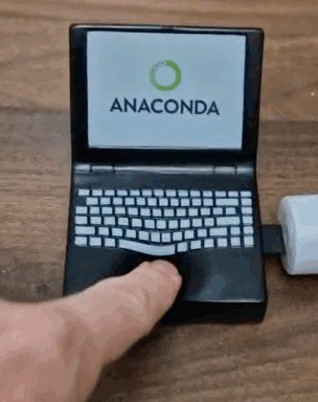

# stress-ball stress-gauge

Put a stress-gauge in a stress-ball

 

## Requirements

- Python 3.13+
- Raspberry Pi Pico with force sensor connected via USB
- macOS, Windows, or Linux

Install `main.py` on your Pico with [Thonny](https://projects.raspberrypi.org/en/projects/getting-started-with-the-pico)

[Instructions for connecting a stress sensor to the Pico](https://newbiely.com/tutorials/raspberry-pico/raspberry-pi-pico-force-sensor)

## Installation

1. Clone the repository:

```bash
git clone https://github.com/yourusername/stress-ball.git
cd stress-ball/stress-ball
```

Create a virtual environment:

```bash
python -m venv .venv
source .venv/bin/activate  # On Windows: .venv\Scripts\activate
```

Install dependencies:

```bash
pip install briefcase
```
## Running the App

### Development Mode

```bash
briefcase dev
```
Build and Run

```bash
briefcase build
briefcase run
```
